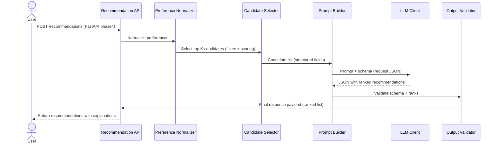

# Data Flow and Components

## End-to-End Request Flow

### Sequence (single recommendation request)


## Major Components (with responsibilities)

### 1) Data Ingestion & Preprocessing
**`DatasetLoader`**
- Downloads the dataset from Hugging Face.
- Stores raw data locally (optional) to avoid repeated downloads.

**`Preprocessor`**
- Extracts a consistent schema:
  - `restaurant_id` (or deterministic key)
  - `name`
  - `location` (city/locality)
  - `cuisine` (single or list, normalized)
  - `rating` (float)
  - `cost_bucket` (derived from raw cost fields if needed)
  - any additional fields that can support explanations
- Writes a preprocessed dataset artifact (CSV/Parquet/JSON lines).

### 2) Preference Normalization
**`UserPreferenceParser`**
- Converts the API request into internal normalized types:
  - `location` normalized form
  - `budget` mapped to cost bucket thresholds
  - `cuisines[]` normalized
  - `min_rating` as float
  - `extra_preferences[]` as tags

### 3) Candidate Selection (Pre-LLM)
**`CandidateSelector`**
- Filters the preprocessed dataset according to constraints.
- Computes lightweight scores to select top `K` candidates.
- Outputs candidates in a strict schema for prompting.

### 4) Prompt Building
**`PromptBuilder`**
- Builds an LLM prompt that includes:
  - normalized user preferences
  - candidate restaurants limited to top `K`
  - explicit instructions to return JSON only
  - explanation constraints (ground in provided attributes)

### 5) LLM Client
**`LLMRecommendationClient`**
- Calls the model with:
  - prompt messages
  - temperature and other generation settings (low for stability)
  - request for structured JSON response
- Phase 3 provider is **Gemini**, with `GEMINI_API_KEY` read from `.env`.

### 6) Output Validation and Repair
**`StructuredOutputValidator`**
- Validates JSON matches the schema:
  - list length, required fields, types
  - each recommendation references a candidate from the provided list
  - ranks are unique and within expected bounds
- Repair strategy:
  - if minor issues, attempt a "repair" pass with a stricter prompt
  - if major mismatch, fall back to deterministic top candidates and generate simpler explanations

### 7) Response Formatting
**`ResponseFormatter`**
- Converts validated data into the final API response:
  - `name`, `cuisine`, `rating`, `estimated_cost`, `explanation`, `rank`

## Candidate Schema for Prompting
Each candidate provided to the LLM should be minimal but sufficient to explain:
```json
{
  "restaurant_id": "string",
  "name": "string",
  "cuisine": "string | string[]",
  "location": "string",
  "rating": 4.2,
  "cost_bucket": "low|medium|high"
}
```

## Practical Candidate Limits
To prevent token overflow:
- choose `K` (e.g., 20-50) based on average candidate field size
- truncate long cuisine lists and enforce max string lengths

